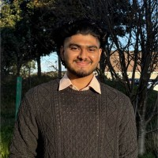
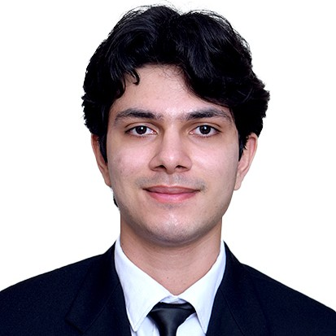
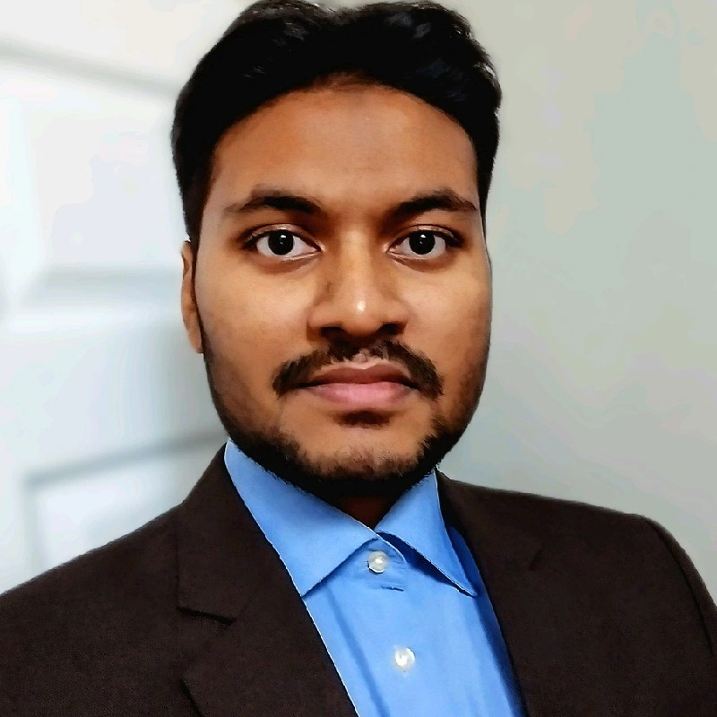

# Valiant Aerotech
End-to-end stack for autonomous UAV missions in one place:
- Planning
- Integration
- Actuation

This repo keeps the three teams decoupled via versioned contracts while sharing tooling, tests, and CI.

# People
Our team consists of students from diverse backgrounds, including mechanical, electrical, and software engineering.

## Executive Team

|  [Mohammad Awad](https://www.linkedin.com/in/mohammad-mamoun-awad/) **President** |
|:---:|

## Team Leads

|  [Alif Ayman Mahin]() **Mechanical Team Lead** |  [Mirza Taimur Ali Baig]() **Electrical Team Lead** |  [Waleed Mannan Khan Sherwani](https://www.linkedin.com/in/wmksherwani/) **Software Team Lead** |
|:---:|:---:|:---:|

## Engineering Team

|  [Devansh Dalal](https://www.linkedin.com/in/devansh-dalal/) **Software & Electrical** |  [Rohan Torul](https://www.linkedin.com/in/rohan-k-torul/) **Software** |  [Mohammad Rakin Kibria](https://www.linkedin.com/in/rakin-kibria-443417290/) **Software** |
|:---:|:---:|:---:|

